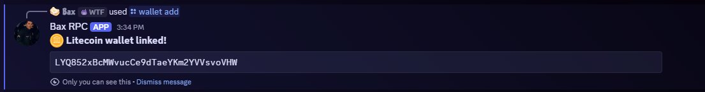
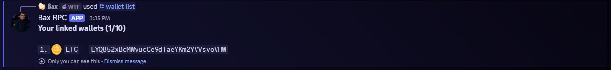
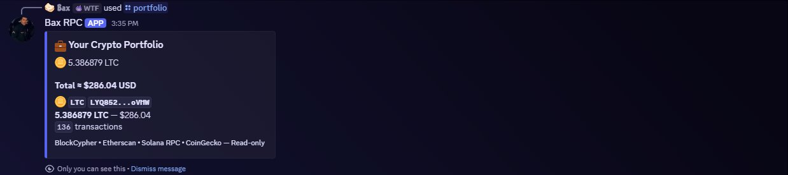

<div align="center">

# 💼 Crypto Portfolio Bot

**Track your BTC, ETH, LTC & SOL wallets in Discord — live balances, USD value, persistent storage.**

[](https://golang.org)
[](https://sqlite.org)
[](LICENSE)
[]()
[]()

</div>

---

## 📸 Preview

**`/wallet add`** — auto-detects the coin and links the wallet



**`/wallet list`** — shows all linked wallets with coin and address



**`/portfolio`** — live balance and USD value



---

## ✨ Features

- 🔍 **Auto-detects coin** from address — just paste any address, no need to specify the coin
- 💾 **SQLite persistence** — wallets survive bot restarts
- 💱 **4 chains** — BTC, ETH, LTC, SOL
- 💵 **Live USD prices** via CoinGecko
- 🔒 **Ephemeral responses** — only you can see your portfolio
- 👤 Up to **10 wallets** per user

---

## 🚀 Commands

| Command | Description |
|---|---|
| `/wallet add <address>` | Link a wallet — coin auto-detected |
| `/wallet remove <address>` | Unlink a wallet |
| `/wallet list` | Show all your linked wallets |
| `/portfolio` | Live balances + USD value for all wallets |

**Supported address formats:**

| Coin | Formats |
|---|---|
| ₿ BTC | `1...` `3...` `bc1...` |
| 💎 ETH | `0x...` (42 chars) |
| 🪙 LTC | `L...` `M...` `ltc1...` |
| ◎ SOL | Base58 (32–44 chars) |

---

## ⚙️ Setup

### 1. Clone

```bash
git clone https://github.com/yourusername/crypto-portfolio-bot
cd crypto-portfolio-bot
```

### 2. Install dependencies

```bash
go mod tidy
```

### 3. Configure `.env`

```bash
cp .env.example .env
```

```env
DISCORD_TOKEN=your_bot_token_here
GUILD_ID=your_server_id_here
ETHERSCAN_API_KEY=optional_but_recommended
```

> - `GUILD_ID` — set during development for instant command registration. Remove for global (takes ~1hr).
> - `ETHERSCAN_API_KEY` — optional. Get a free one at [etherscan.io/apis](https://etherscan.io/apis) for higher ETH rate limits.

### 4. Run

```bash
go run main.go
```

A `wallets.db` SQLite file will be created automatically on first run.

---

## 🤖 Creating a Discord Bot

1. Go to [discord.com/developers/applications](https://discord.com/developers/applications)
2. **New Application** → name it
3. **Bot** → **Reset Token** → copy → paste into `.env` as `DISCORD_TOKEN`
4. Enable **Server Members Intent** under Privileged Gateway Intents
5. **OAuth2 → URL Generator**:
   - Scopes: `bot` + `applications.commands`
   - Bot Permissions: `Send Messages`
6. Open the generated URL and invite the bot

**Getting your Guild ID:**
- Discord Settings → Advanced → **Developer Mode** ✅
- Right-click your server → **Copy Server ID** → paste as `GUILD_ID`

---

## 🔗 APIs Used

| Data | API | Key Required |
|---|---|---|
| BTC & LTC balance | [BlockCypher](https://www.blockcypher.com/dev/) | ❌ No |
| ETH balance | [Etherscan](https://etherscan.io/apis) | ⚠️ Optional (free) |
| SOL balance | [Solana RPC](https://docs.solana.com/api/http) | ❌ No |
| All coin prices | [CoinGecko](https://www.coingecko.com/en/api) | ❌ No |

---

## 🗂️ Project Structure

```
crypto-portfolio-bot/
├── main.go        # entire bot — DB, API calls, Discord handlers
├── wallets.db     # auto-created SQLite database
├── go.mod
├── go.sum
├── .env
└── .env.example
```

---

## 🗺️ Roadmap

- [x] LTC wallet tracking
- [x] BTC, ETH, SOL support
- [x] SQLite persistence
- [ ] `/alert <coin> <price>` — DM on price target hit
- [ ] Daily portfolio digest (scheduled)
- [ ] `/history` — 7-day balance chart

---

## 📄 License

MIT © [Bax](https://github.com/baxqc)
